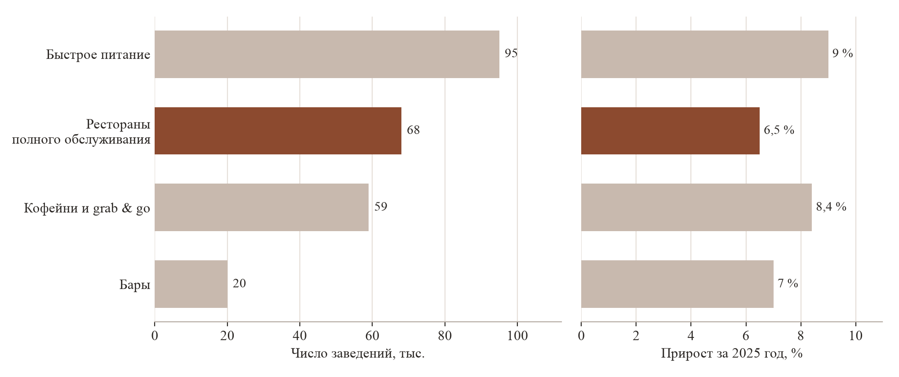

# 3 Описание отрасли

## Характеристика отрасли

Проект работает на стыке двух отраслей. Отрасль-потребитель — рестораны с посадочными
местами, где заказ принимает официант. Отрасль, к которой относится продукт, —
разработка программного обеспечения для автоматизации предприятий общественного
питания. Спрос определяется состоянием обеих: экономикой ресторанов, формирующей
потребность, и уровнем их автоматизации, делающим подключение возможным.

По данным INFOLine, по итогам 2025 года в России действовало более 240 тысяч
предприятий общественного питания, что на 8 % больше, чем годом ранее [1]. Оборот
отрасли составил 4,29 трлн рублей [2]. Распределение заведений по форматам приведено
на рисунке 1.

*Рисунок 1 — Число заведений общественного питания и прирост за 2025 год по форматам
(по данным INFOLine [1])*

Рестораны с полным обслуживанием образуют второй по величине сегмент — около
68 тысяч заведений, — но растут медленнее прочих форматов: 6,5 % против 9 %
у быстрого питания и 8,4 % у кофеен и заведений формата grab & go. Формат
с официантами проигрывает быстрым форматам в скорости и цене и не конкурирует
с ними по числу чеков; его экономика опирается на величину чека и возвращаемость
гостя — показатели, на которые влияет персонализация обслуживания.

Уровень автоматизации сегмента достаточен для работы платформы. Система учёта
обслуживает в таких заведениях не только расчёт с гостем, но и работу зала, склада
и кухни. На рынке систем учёта сложилась двойная концентрация: подавляющее
большинство заведений обслуживают iiko и r_keeper [3]. Интеграция с двумя
программными интерфейсами (API) покрывает основную часть целевого сегмента.

## Структура рынка

Целевой рынок — программное обеспечение для ресторанов с полным обслуживанием,
использующее накопленные данные о гостях. Решения различаются тем, кому и в какой
момент они отдают результат обработки данных.

1. **Системы учёта и автоматизации** (iiko, r_keeper, Poster). Собирают данные
   о заказах и гостях, предоставляют аналитику. Получатель — менеджер, момент —
   отчётный период. Официант работает в интерфейсе этих систем, но видит в нём
   только заказ.

2. **Программы лояльности и CRM-надстройки** (Plazius, «Фабрика лояльности»,
   Loymax). Используют данные о госте для маркетинговых коммуникаций; развитые
   платформы применяют машинное обучение и определяют любимые блюда гостя по чекам.
   Получатель — гость, канал — мобильное приложение, СМС или push-уведомление.
   Интерфейса для персонала зала не предоставляют.

3. **Системы бронирования и CRM для управления залом** (ReMarked, Restoplace,
   Saby Presto). Ведут схему зала и посадку, накапливают профиль гостя: частоту
   визитов, средний чек, историю заказов, любимые блюда, пометки о предпочтениях;
   часть систем передаёт брони в iiko и r_keeper. Получатель — хостес и менеджер,
   момент — приём брони и встреча гостя. Сведения отображаются в том виде, в каком
   накоплены; ранжирование меню под гостя не выполняется.

4. **Инструменты официанта** (iikoWaiter, FusionPOS, YUMA). Обслуживают формирование
   заказа, обмен с кухней, печать чека и приём чаевых. Отдельные приложения выводят
   подсказки для допродажи, привязанные к позиции в заказе, а не к гостю. Профиль
   гостя не отображается.

Данные о госте в отрасли собираются и обрабатываются, в том числе алгоритмами
машинного обучения, но результат поступает либо менеджеру после смены, либо гостю
в отдельный канал коммуникации. Официант остаётся единственным участником
обслуживания, который в момент контакта с гостем не располагает ничем, кроме
текущего заказа. Boostaurant занимает эту позицию: он не заменяет систему учёта
или программу лояльности, а работает поверх данных системы учёта, добавляя
недостающего получателя.

Системы учёта конкурентами не являются — они поставщики данных и условие работы
платформы; проникновение iiko и r_keeper в целевом сегменте определяет размер
доступного рынка. Разбор конкурирующих решений приведён в разделе 4.1.

## Тенденции и перспективы развития отрасли

**Падение трафика при сохранении номинального оборота.** Оборот отрасли вырос,
но в сопоставимых ценах прирост составил 2,6 % против 12–14 % годом ранее [4]:
рост достигнут за счёт открытия новых заведений и повышения цен на 15,3 %, а не
за счёт увеличения числа гостей. По оценке Like4Like, падение трафика испытывают
80–90 % игроков рынка, у отдельных брендов оно доходит до 20–30 % [1].

Ресторан, потерявший часть потока, не может компенсировать потерю дальнейшим
повышением цен — этот ресурс исчерпан в 2025 году — и вынужден работать над выручкой
с каждого пришедшего гостя. Спрос на инструменты, влияющие на средний чек
и возвращаемость, растёт, тогда как спрос на инструменты привлечения потока
сжимается.

**Рост налоговой нагрузки.** Порог выручки, дающий право на освобождение от налога
на добавленную стоимость при упрощённой системе налогообложения, снижается
последовательно: 60 млн рублей в 2025 году, 20 млн в 2026, 15 млн в 2027 и 10 млн
в 2028 году [5]. Введённое законом от 25 апреля 2026 года № 104-ФЗ освобождение
для предприятий общественного питания ограничено периодом до 31 декабря 2026 года [6].
Заведение целевого сегмента — от 1 000 заказов в месяц — превышает порог 2026 года
и все последующие, то есть является плательщиком налога. Нагрузка на отрасль
возрастает в течение всего рассматриваемого горизонта, что усиливает описанную
выше тенденцию: значение выручки с каждого гостя увеличивается, а свободные
средства заведения на новые расходы сокращаются. Обе стороны этого обстоятельства
рассмотрены в разделе «Анализ рисков».

**Кадровый дефицит и сменяемость персонала.** Отрасль испытывает нехватку персонала,
заведения вынуждены повышать заработную плату [1]. При высокой сменяемости официантов
знание постоянных гостей не накапливается: опытный сотрудник уходит вместе с ним,
новый начинает с нуля. Платформа переносит это знание из памяти сотрудника в систему,
где оно сохраняется независимо от состава смены.

**Рост рынка цифровизации HoReCa.** По оценке TAdviser, рынок автоматизации HoReCa
в ближайшие три года будет расти на 9–13 % ежегодно, основной драйвер — спрос
на решения по модели SaaS [3]. Модель распространения проекта совпадает с этим
драйвером: ресторан не приобретает оборудование и не оплачивает внедрение отдельно.

**Импортозамещение.** Уход зарубежных поставщиков закрепил лидерство отечественных
систем автоматизации и бронирования [3]. Ключевые для проекта интеграции — iiko
и r_keeper — относятся к российским продуктам с устойчивым положением на рынке.

**Поляризация форматов.** Прогнозы предполагают дальнейшее расхождение: быстрое
питание усиливает позиции за счёт доступности и скорости, рестораны полного
обслуживания растут за счёт качества обслуживания как самостоятельной ценности [1].
Узнавание гостя и точное предложение относятся к качеству обслуживания, а не к цене
блюда.

**Внедрение искусственного интеллекта в обслуживание.** Технологии рекомендаций,
освоенные в электронной торговле, начинают применяться в HoReCa; системы
рекомендаций и персонализации оцениваются как одно из наиболее маржинальных
направлений цифровизации отрасли [3].

## Тип рынка

Тип рынка — монополистическая конкуренция с признаками формирующегося рынка.

- **Множество продавцов.** На рынке программного обеспечения для ресторанов
  действуют системы учёта, программы лояльности, системы бронирования, сервисы
  аналитики и управления отзывами. В позиции, занимаемой проектом — персональные
  рекомендации официанту в момент обслуживания, — рынок только формируется.

- **Дифференцированный продукт.** Решения различаются составом функций, получателем
  результата и моделью распространения; сравнение по цене затруднено, поскольку они
  закрывают разные задачи. Проект дифференцирован по получателю результата —
  официант — и моменту его получения.

- **Неценовая конкуренция.** Поставщики конкурируют функциями, трудоёмкостью
  внедрения, наличием интеграций и подтверждёнными результатами у заказчиков,
  а не стоимостью подписки.

- **Умеренные барьеры входа при существенных издержках переключения у заказчика.**
  Начать разработку конкурирующего решения технологически несложно. Ресторан
  с обученной на его данных моделью переключается на другого поставщика неохотно:
  качество рекомендаций у нового поставщика восстанавливается не сразу.

- **Зависимость от поставщиков систем учёта.** Работоспособность продукта
  определяется доступностью программных интерфейсов iiko и r_keeper: поставщики
  систем учёта, не будучи конкурентами, влияют на условия работы проекта. Риск
  и меры его нивелирования рассмотрены в разделе «Анализ рисков».

## Источники к разделу

1. Итоги 2025 года для общепита: падение трафика, рост себестоимости, конкуренция
   с ритейлом [Электронный ресурс] // Retail.ru — сайт о розничной торговле. —
   URL: https://www.retail.ru/articles/itogi-2025-goda-dlya-obshchepita-padenie-trafika-rost-sebestoimosti-konkurentsiya-s-riteylom/
   (дата обращения: 09.08.2026).
2. В 2021–2025 гг оборот общественного питания в России увеличился в 2,2 раза:
   с 1,93 до 4,29 трлн руб. [Электронный ресурс] // РБК Магазин исследований. —
   URL: https://marketing.rbc.ru/articles/16377/ (дата обращения: 09.08.2026).
3. Российский рынок цифровизации HoReCa: оценки и технологии. Обзор TAdviser
   [Электронный ресурс] // TAdviser — портал выбора технологий и поставщиков. —
   URL: https://www.tadviser.ru/index.php/Статья:Российский_рынок_цифровизации_HoReCa._Обзор_TAdviser
   (дата обращения: 09.08.2026).
4. Российский рынок общепита вырос в 2025 году всего на 2,6 % [Электронный ресурс] //
   Sostav.ru — реклама, маркетинг, PR. —
   URL: https://www.sostav.ru/publication/rossijskij-rynok-obshchepita-vyros-v-2025-godu-vsego-na-2-6-84047.html
   (дата обращения: 09.08.2026).
5. УСН и НДС в 2026 году: новые лимиты доходов, ставки и отчётность [Электронный
   ресурс] // Контур.Экстерн — сервис электронной отчётности. —
   URL: https://www.kontur-extern.ru/info/81877-usn_i_nds (дата обращения: 16.08.2026).
6. Льгота по НДС в общепите: правила 2026 года [Электронный ресурс] // Клерк.ру —
   портал для бухгалтеров. — URL: https://www.klerk.ru/buh/articles/700037/
   (дата обращения: 16.08.2026).
