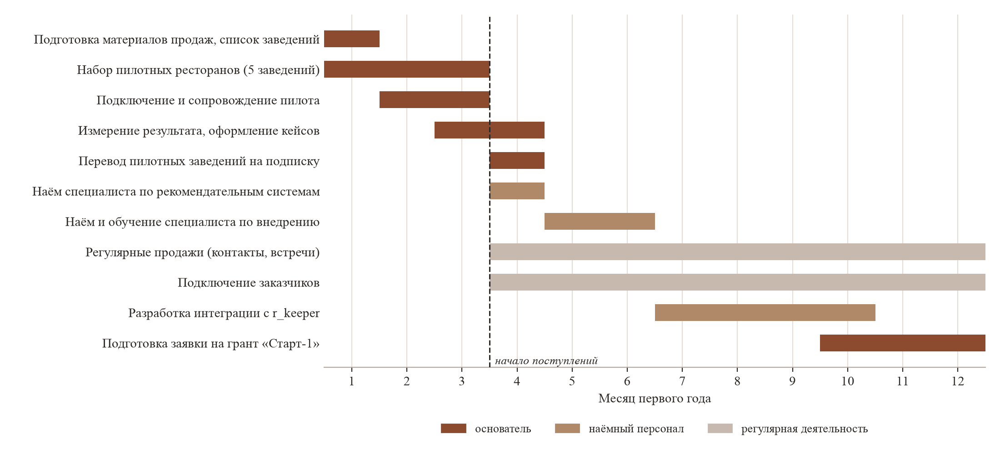

# 5 Организационный план

## Организационная структура

Тип структуры — линейная. Все работники подчинены непосредственно генеральному
директору, промежуточные звенья управления отсутствуют. Выбор определяется
численностью предприятия: до шести человек к третьему году, что не требует
разделения на подразделения.

По мере роста числа заказчиков к третьему году обособляется направление внедрения
и сопровождения — группа из трёх специалистов с координацией силами наиболее
опытного из них. Выделение отдельной должности руководителя направления
на рассматриваемом горизонте не предусмотрено.

## Штатное расписание

Потребность в персонале определена расчётом нагрузки: трудоёмкость подключения
и сопровождения заказчиков (раздел 4.3) и трудоёмкость продаж (раздел 4.4).

| Должность | 1-й год | 2-й год | 3-й год | Оклад, руб./мес. |
|---|---|---|---|---|
| Генеральный директор | 1 | 1 | 1 | 33 866 |
| Специалист по рекомендательным системам | 1 | 1 | 2 | 100 000 → 140 000 |
| Специалист по внедрению | 1 | 2 | 3 | 70 000 → 75 000 |
| **Численность** | **3** | **4** | **6** | |

*Таблица 1 — Штатное расписание*

Оклад генерального директора установлен на уровне минимального размера оплаты труда
по Новосибирской области с учётом районного коэффициента 1,25 — 33 866 рублей [1].
Основатель является единственным учредителем, и на этапе, когда предприятие
не приносит прибыли, вознаграждение за труд ограничено законодательно установленным
минимумом; доход учредителя образуется распределением прибыли начиная со второго
года.

Оклады специалистов установлены по нижней границе рынка труда Новосибирска
для соответствующих должностей с последующим доведением до среднерыночного уровня:
для специалистов по обработке данных рынок составляет 130–160 тысяч рублей [2],
для специалистов внедрения и технической поддержки — 60–80 тысяч рублей [3].

## Порядок найма

Наём привязан не к календарю, а к достижению результатов, что позволяет
не расходовать средства до появления подтверждённого спроса.

**Специалист по рекомендательным системам** принимается после перевода пилотных
заведений на подписку — по плану с четвёртого месяца. До этого момента разработка
и обучение моделей выполняются основателем. Начальный оклад — 100 000 рублей;
повышение до среднерыночного уровня производится по мере роста числа заказчиков.
Требования: владение методами машинного обучения применительно к рекомендательным
системам, Python, SQL. Квалификация уровня middle или выпускник высшего учебного
заведения соответствующего направления: задача не предполагает разработки новых
алгоритмов — применяемые методы отобраны и проверены на этапе прототипа, — и состоит
в обучении моделей на данных заказчиков, контроле качества выдачи и развитии
платформы.

**Специалист по внедрению** принимается после перевода пяти пилотных заведений
на подписку, с пятого месяца, и проходит обучение силами основателя. Требования
к квалификации умеренные: подключение выполняется по установленному порядку
(раздел 4.5), инструктаж персонала ресторана занимает около часа. Должность
предполагает работу с заказчиком, поэтому существенны навыки общения, а не только
техническая подготовка.

**Второй специалист по внедрению** принимается с четвёртого месяца второго года.
Срок определён расчётом пропускной способности (раздел 6): к этому моменту
сопровождение накопленной базы заказчиков поглощает такую долю рабочего времени
первого специалиста, что плановый темп подключений становится недостижимым.
Более ранний наём привёл бы к кассовому разрыву, поскольку поступления
от подключений, выполненных новым работником, возникают с задержкой в два месяца:
бесплатный период и месяц накопления оплаты.

Расширение штата на третьем году — второй специалист по рекомендательным системам
и третий специалист по внедрению — определяется ростом числа заказчиков
до 200 и подтверждается расчётом нагрузки (раздел 4.3).

## Распределение обязанностей

| Должность | Обязанности |
|---|---|
| Генеральный директор | Продажи: прямые обращения, встречи, демонстрации, заключение договоров. Общее руководство, отчётность, взаимодействие с Фондом. В первый год — разработка и подключение заказчиков |
| Специалист по рекомендательным системам | Обучение и переобучение моделей на данных заказчиков, контроль качества рекомендаций, развитие платформы, разработка интеграции с r_keeper, поддержание работоспособности сервиса |
| Специалист по внедрению | Подключение заказчиков: настройка доступа к системе учёта, выгрузка и проверка данных, инструктаж персонала. Сопровождение действующих заказчиков, ежемесячная отчётность заказчику |

*Таблица 2 — Распределение обязанностей*

Продажи закреплены за генеральным директором на всём рассматриваемом горизонте.
Продукт новый для отрасли, возражения заказчика касаются как экономики заведения,
так и обработки данных о гостях, поэтому передача продаж наёмному сотруднику
потребовала бы подготовки, сопоставимой по трудоёмкости с самими продажами.
При достигаемом объёме — до 83 контактов и 33 встреч в месяц к третьему году
(раздел 4.4) — нагрузка остаётся выполнимой.

## Фонд оплаты труда

В первые два года страховые взносы не уплачиваются: предприятие применяет
автоматизированную упрощённую систему налогообложения, предусматривающую нулевой
тариф взносов (раздел 7). Вместо них уплачивается страхование от несчастных
случаев — 2 959 рублей в год.

С третьего года численность работников превышает установленный для АУСН предел
в пять человек, режим заменяется общей системой налогообложения, и взносы
исчисляются по льготному тарифу для аккредитованных организаций, осуществляющих
деятельность в области информационных технологий: 15 % с выплат в пределах базы
2 979 000 рублей и 7,6 % с выплат сверх неё [4].

Государственная аккредитация в Министерстве цифрового развития требуется
независимо от применяемого режима: она является условием включения в реестр малых
технологических компаний и учитывается при рассмотрении заявок на гранты
(раздел 8), а с третьего года даёт право на пониженный тариф взносов. Условия
аккредитации в редакции, действующей с 1 января 2026 года [5]:

| Условие | Состояние |
|---|---|
| Основной ОКВЭД из утверждённого перечня (62.01, 62.02, 63.11.1 и др.) | Выполняется |
| Доля профильной выручки свыше 30 % | Выполняется: иных источников выручки нет |
| Доля участия граждан РФ свыше 50 % | Выполняется |
| Постоянно работающий сайт с описанием деятельности и стоимости услуг | Выполняется |
| Средняя заработная плата не ниже средней по региону | Не выполняется в первый год |
| Задолженность по налогам не более 3 000 рублей | Выполняется |

*Таблица 4 — Условия государственной аккредитации*

Требование к уровню средней заработной платы в первый год не выполняется:
вознаграждение генерального директора установлено на уровне минимального размера
оплаты труда, что снижает средний показатель по предприятию. Требование
не применяется к организациям, включённым в реестр малых технологических компаний,
поэтому включение в реестр предшествует подаче заявления об аккредитации.

Основанием для включения служит полученная государственная поддержка инновационной
деятельности: для организаций, получивших её не ранее трёх лет назад, предусмотрен
заявительный порядок без прохождения независимой экспертизы [6]. Предприятие
отвечает этому условию — грант Фонда содействия инновациям по договору
1105ГССС27/106900 получен в 2025 году, — вследствие чего включение в реестр
не требует расходов на экспертизу, оцениваемых в 60 тысяч рублей.

Использование регионального реестра стартапов, дающего то же освобождение,
для предприятия недоступно: в Новосибирской области такой реестр не утверждён,
а с 1 января 2026 года упрощённый порядок для организаций из регионов без реестра
отменён.

Помимо освобождения от требования к заработной плате статус малой технологической
компании даёт пониженную ставку налога на прибыль, преимущество при рассмотрении
заявок на гранты и доступ к льготному кредитованию, что учитывается
в инвестиционном плане (раздел 8).

| Показатель | 1-й год | 2-й год | 3-й год |
|---|---|---|---|
| Фонд оплаты труда, млн руб. | 1,87 | 3,56 | 6,47 |
| Страховые взносы, млн руб. | — | — | 0,97 |
| Страхование от несчастных случаев, млн руб. | 0,003 | 0,003 | — |
| **Итого расходы на персонал, млн руб.** | **1,87** | **3,56** | **7,44** |

*Таблица 5 — Расходы на оплату труда*

Фонд оплаты труда рассчитан помесячно с учётом порядка найма: в первый год
генеральный директор получает вознаграждение с первого месяца, специалист
по рекомендательным системам — с четвёртого, специалист по внедрению — с пятого;
во второй год второй специалист по внедрению — с четвёртого месяца.

## План-график первого года

Последовательность работ первого года приведена на рисунке 1.

*Рисунок 1 — План-график работ первого года*

Первые три месяца поступления отсутствуют: пилотные заведения пользуются сервисом
безвозмездно. Этот период определяет потребность в финансировании и является
наиболее уязвимым: при недостижении договорённостей с пятью заведениями сдвигаются
все последующие этапы, включая наём.

Контрольные точки первого года:

| Месяц | Контрольная точка |
|---|---|
| 3 | Пять пилотных заведений подключены, результат измерен |
| 4 | Пилотные заведения переведены на подписку, принят специалист по рекомендательным системам |
| 5 | Принят специалист по внедрению |
| 10 | Завершена разработка интеграции с r_keeper, доступен сегмент заведений на этой системе |
| 12 | 30 действующих заказчиков, подана заявка на грант «Старт-1» |

*Таблица 6 — Контрольные точки первого года*

Разработка интеграции с r_keeper отнесена ко второму полугодию: до накопления
заказчиков на iiko расширение перечня поддерживаемых систем учёта не увеличивает
продаж, тогда как отвлечение единственного специалиста на эту работу замедлило бы
подключение действующих заказчиков.

Подготовка заявки на грант «Старт-1» начинается с десятого месяца. Подача возможна
только после завершения действующего договора с Фондом содействия инновациям
и закрытия отчётности по нему; поступление средств ожидается в течение второго года
и учитывается в инвестиционном плане (раздел 8).

## Источники к разделу

1. Размер МРОТ в Новосибирской области в 2026 году [Электронный ресурс] //
   ГосУслуги.Гид — справочный портал. — URL: https://gogov.ru/mrot/nso
   (дата обращения: 11.08.2026).
2. Зарплата Python-разработчика 2026 — вилки по уровням [Электронный ресурс] //
   IT-Mentor — образовательный портал. —
   URL: https://www.it-mentor.dev/articles/zarplata-python-razrabotchika-2026
   (дата обращения: 11.08.2026).
3. Средняя зарплата на должности «Специалист по внедрению» [Электронный ресурс] //
   Dream Job — сервис отзывов о работодателях. —
   URL: https://dreamjob.ru/salary/specialist-po-vnedreniyu (дата обращения: 11.08.2026).
4. Налоговые льготы для IT-компаний в 2026 году: главные изменения и новые условия
   [Электронный ресурс] // Клерк.ру — портал для бухгалтеров. —
   URL: https://www.klerk.ru/blogs/moedelo/670400/ (дата обращения: 11.08.2026).
5. Как получить IT-аккредитацию в 2026: актуальные требования Минцифры и пошаговая
   инструкция [Электронный ресурс] // Хабр — сообщество IT-специалистов. —
   URL: https://habr.com/ru/articles/1064044/ (дата обращения: 11.08.2026).
6. Реестр малых технологических компаний [Электронный ресурс] // Министерство
   экономического развития Российской Федерации. —
   URL: https://www.economy.gov.ru/material/departments/d01/razvitie_tehnologicheskogo_predprinimatelstva/reestr_malyh_tehnologicheskih_kompaniy/
   (дата обращения: 11.08.2026).
