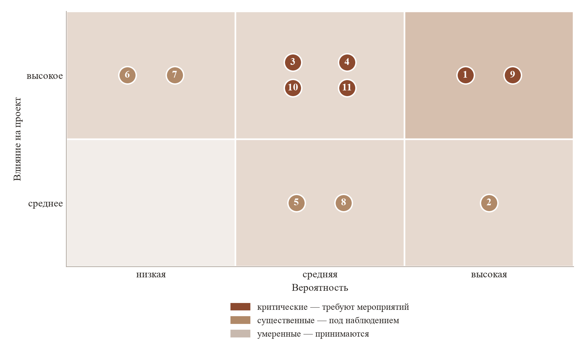

# 9 Анализ рисков

Риск — вероятное событие, наступление которого изменяет условия осуществления проекта.
Настоящий раздел выделяет события, способные повлиять на достижение показателей
разделов 7 и 8, оценивает их вероятность и влияние и определяет мероприятия
по снижению для рисков высокого уровня.

Перечень намеренно ограничен рисками, специфичными для настоящего проекта.
Общие для любого предприятия обстоятельства — болезнь работника, ошибки в оценке
трудоёмкости, отказ оборудования — учтены не отдельными позициями, а порядком
планирования: наём привязан к достигнутым результатам, а не к календарю (раздел 5),
и в плане первого года предусмотрен резерв 291 тыс. рублей (раздел 8).

## Перечень рисков

| № | Группа | Риск | Источник |
|---|---|---|---|
| 1 | Отраслевые | Снижение платёжеспособности заведений вследствие роста налоговой нагрузки | Внешний |
| 2 | Отраслевые | Продолжение сокращения числа предприятий общественного питания | Внешний |
| 3 | Конкурентные | Появление рекомендаций официанту у платформ лояльности и систем учёта | Внешний |
| 4 | Технологические | Изменение условий доступа к программному интерфейсу iiko | Внешний |
| 5 | Технологические | Зависимость от единственной системы учёта в первый год | Внутренний |
| 6 | Технологические | Отказ сервиса или утрата данных заказчика | Внутренний |
| 7 | Правовые | Нарушение установленного порядка обработки персональных данных | Внутренний |
| 8 | Правовые | Утрата права на применение АУСН вследствие роста численности | Внутренний |
| 9 | Коммерческие | Недостижение планового числа подключений | Внутренний |
| 10 | Коммерческие | Отток заказчиков выше принятого в расчётах | Внешний |
| 11 | Кадровые | Уход работника, замещающего ключевую должность | Внутренний |

*Таблица 1 — Перечень рисков проекта*

Оценка вероятности и влияния приведена на рисунке 1. Влияние определено
по последствию для показателей финансового плана: высокое — недостижение
плановой выручки или утрата платёжеспособности, среднее — рост расходов
или смещение сроков в пределах резерва.

*Рисунок 1 — Матрица рисков*

Рисков низкого влияния перечень не содержит: события такого уровня поглощаются
резервом и отдельного рассмотрения не требуют.

## Отраслевые риски

**Риск 1. Снижение платёжеспособности заведений.** Порог выручки, дающий право
на освобождение от налога на добавленную стоимость при упрощённой системе
налогообложения, последовательно снижается: 60 млн рублей в 2025 году, 20 млн
в 2026, 15 млн в 2027 и 10 млн в 2028 году [1]. Законом от 25 апреля 2026 года
№ 104-ФЗ для предприятий общественного питания введено временное освобождение
на период с 1 апреля по 31 декабря 2026 года с отменой требования к уровню
средней заработной платы [2]; действие освобождения ограничено 2026 годом.

Для целевого сегмента послабление имеет ограниченное значение. Заведение
с 1 000 заказов в месяц при среднем чеке 2 710 рублей (раздел 4.2) имеет годовой
оборот около 32,5 млн рублей, то есть превышает порог 2026 года и все последующие.
Типичный заказчик является плательщиком налога на добавленную стоимость,
и налоговая нагрузка на него возрастает в течение всего рассматриваемого горизонта.

Риск отнесён к высокому по обоим измерениям: он реализуется в период,
на который приходится первый год деятельности, и прямо влияет на готовность
владельца принять решение о новом ежемесячном расходе.

Влияние риска не является односторонним. Рост налоговой нагрузки при исчерпанном
ресурсе повышения цен (раздел 3) увеличивает ценность выручки с каждого пришедшего
гостя, то есть той величины, на которую воздействует продукт. Обоснование покупки
из соображения улучшения обслуживания смещается к соображению сохранения
рентабельности. Это меняет содержание аргументации при продаже, но не устраняет
затруднения: сокращение свободных средств у заказчика удлиняет срок принятия
решения независимо от убедительности расчёта окупаемости.

**Риск 2. Сокращение числа заведений.** За 2025 год ликвидировано 35,4 тыс.
предприятий общественного питания, что почти на 10 % превышает показатель
2024 года [3]. В городах-миллионниках за год число ресторанов уменьшилось
на 5 % (раздел 4.2). Сокращение уменьшает как ёмкость рынка, так и базу действующих
заказчиков: закрытие заведения прекращает подписку независимо от качества сервиса.

Влияние оценено как среднее. Оценка ёмкости рынка (раздел 4.3) использует
6,6 % доступного объёма, вследствие чего сокращение сегмента на несколько процентов
в год не создаёт ограничения для плана продаж. Значение риска состоит в другом:
он задаёт нижнюю границу оттока, не зависящую от свойств продукта, и потому
рассматривается совместно с риском 10.

## Конкурентные риски

**Риск 3. Появление рекомендаций официанту у смежных решений.** Позиция, занимаемая
продуктом, определяется получателем результата и моментом его получения (раздел 3).
Платформы лояльности располагают данными о госте и применяют машинное обучение;
недостающим является интерфейс для персонала зала. Разработка такого интерфейса
для них технологически осуществима.

По состоянию на август 2026 года публично объявленных решений, выдающих официанту
персональные рекомендации в момент обслуживания, у платформ лояльности и систем
учёта не обнаружено; вывод раздела 4.1 о незанятости позиции сохраняет силу.
Отдельного внимания заслуживает то обстоятельство, что платформа Plazius
продвигается через каналы iiko, то есть в смежной нише у поставщика системы учёта
имеется партнёр.

Вероятность оценена как средняя, влияние — как высокое: появление такой функции
у поставщика, уже установленного в ресторане, обесценивает основное преимущество
продукта.

Мероприятия. Первое — использование преимущества во времени: план предусматривает
30 подключений за первый год, и заведение с обученной на его данных моделью
переключается на другого поставщика неохотно (раздел 3). Второе — накопление
сведений, отсутствующих в системе учёта: заметки официантов о предпочтениях
и аллергиях гостей образуют данные, которых у платформы лояльности нет и которые
при переходе к другому поставщику теряются (раздел 4.5). Третье — ежеквартальный
обзор функций смежных решений и объявлений поставщиков систем учёта.

## Технологические риски

**Риск 4. Изменение условий доступа к программному интерфейсу iiko.** Доступ
к интерфейсу и документации предоставляется разработчикам безвозмездно, партнёрский
договор для интеграции стороннего решения с установленной у заказчика системой
не требуется — этому соответствует модель «Custom» [4]. Наряду с ней предусмотрены
модели «Connector» и «Solution», требующие сертификации интеграционного решения;
в модели «Connector» ресторан оплачивает разработчику использование
сертифицированного модуля начиная от 1 000 рублей в месяц за заведение [4].

Риск состоит в изменении этих условий: введении обязательной сертификации,
установлении платы за обращения к интерфейсу либо ограничении состава
предоставляемых данных. Вероятность оценена как средняя — сложившийся порядок
предполагает свободный доступ, — влияние как высокое, поскольку работоспособность
продукта определяется доступностью интерфейса.

Мероприятия. Обращение к интерфейсу системы учёта сосредоточено в отдельном модуле
(раздел 6), вследствие чего изменение состава или формата предоставляемых данных
затрагивает ограниченную часть кода. Прохождение сертификации по модели «Connector»
рассматривается как приемлемый исход: при цене подписки 10 000 рублей плата
в 1 000 рублей за заведение уменьшает валовую рентабельность с 87 до 77 %,
что не делает продукт убыточным. Устранение зависимости обеспечивается разработкой
интеграции с r_keeper, отнесённой к десятому месяцу первого года (раздел 5).

**Риск 5. Зависимость от единственной системы учёта.** До завершения интеграции
с r_keeper доступным является только сегмент заведений на iiko. Отказ в доступе
либо продолжительная неработоспособность интерфейса в этот период останавливает
подключения полностью.

Влияние оценено как среднее: событие смещает сроки, но не обесценивает созданный
актив, поскольку модели рекомендаций от системы учёта не зависят и работают
на выгруженных данных. Мероприятие — соблюдение срока разработки интеграции
с r_keeper; при обнаружении признаков риска 4 срок подлежит переносу на более
ранний.

Сходной природы зависимость от мессенджера, служащего рабочим местом официанта.
Прототип выполнен на платформе Telegram, доступ к которой ограничен на территории
Российской Федерации, вследствие чего рабочим местом принят бот в мессенджере MAX
(раздел 2). Событие такого рода уже реализовалось и показало действительную
величину последствий: замене подлежит клиентский модуль, оцениваемый
в 40 человеко-часов, тогда как база данных, рекомендательное ядро и интеграция
с системой учёта изменений не требуют. Отделение интерфейса от расчётной части
является поэтому не только техническим решением, но и мерой снижения риска.

**Риск 6. Отказ сервиса или утрата данных заказчика.** Для каждого ресторана
разворачивается отдельный экземпляр платформы с собственной базой данных
(раздел 4.5), вследствие чего отказ затрагивает одного заказчика, а не всех.
Утрата истории заказов и заметок официантов означает потерю накопленного
преимущества и является основанием для расторжения договора.

Вероятность оценена как низкая, влияние — как высокое. Мероприятия: ежесуточное
резервное копирование баз данных заказчиков с хранением копий отдельно
от рабочего сервера; восстановление обученных моделей выгрузкой из системы учёта
заказчика, сохраняющей исходные данные независимо от состояния платформы.

## Правовые риски

**Риск 7. Нарушение порядка обработки персональных данных.** Предприятие
обрабатывает данные гостей ресторана, то есть выступает обработчиком по поручению
заказчика. С 1 сентября 2025 года согласие на обработку оформляется отдельно
от иных подписываемых субъектом документов; штраф за неуведомление уполномоченного
органа о намерении обрабатывать данные достигает 300 тыс. рублей, за несообщение
об утечке — 3 млн рублей [5].

Вероятность оценена как низкая, влияние — как высокое: величина штрафа сопоставима
с потребностью в финансировании первого года, а сведения о нарушении препятствуют
продажам в отрасли, где предметом обработки являются данные гостей.

Мероприятия. Состав обрабатываемых сведений ограничен минимально необходимым:
имя, пол, электронная почта, сведения о картах лояльности не собираются
и не хранятся. Заключение с каждым заказчиком договора поручения на обработку
персональных данных предусмотрено этапом цикла сделки (раздел 4.5, этап 4).
Уведомление уполномоченного органа подаётся до подключения первого заведения.
Проверка состава хранимых сведений и порядка их обработки выполняется привлечённым
специалистом до начала работы с данными заказчиков.

**Риск 8. Утрата права на применение АУСН.** Автоматизированная упрощённая система
налогообложения применяется при численности работников не более пяти человек.
Расчёт исходит из применения режима в течение первых двух лет и перехода на общую
систему с третьего года при достижении численности шести человек (раздел 7).
Освобождение от страховых взносов уменьшает расходы первого года на 280 тыс. рублей
и второго — на 533 тыс.

Риск состоит в досрочном превышении численности — при опережении плана продаж
либо при найме сверх штатного расписания. Право утрачивается с начала месяца,
в котором допущено превышение. Влияние оценено как среднее: событие увеличивает
расходы, но наступает в обстоятельствах роста выручки. Мероприятие — учёт налогового
последствия при принятии решения о найме; при необходимости расширения штата
до истечения второго года рассматривается привлечение исполнителей по договорам
гражданско-правового характера, не увеличивающим численность работников.

## Коммерческие риски

**Риск 9. Недостижение планового числа подключений.** План первого года
предусматривает 30 действующих заказчиков (раздел 4.4). Показатель опирается
на воронку продаж и не подтверждён внедрениями; при этом продукт для отрасли новый,
а решение принимает владелец, чья платёжеспособность снижается вследствие риска 1.

Риск отнесён к высокому по обоим измерениям и является определяющим для проекта:
срок окупаемости задаётся не рентабельностью, а темпом набора клиентской базы
(раздел 8).

Мероприятия. Наём привязан к достижению результатов, а не к календарю (раздел 5):
при отставании от плана приём второго специалиста по внедрению переносится,
что сохраняет платёжеспособность ценой замедления роста. Расходы на оплату труда
составляют 84 % сметы первого года (раздел 7), вследствие чего перенос найма
является действенной мерой. Расчёт устойчивости (раздел 8) показывает, что
при 20 подключениях вместо 30 выручка первого года снижается на 0,36 млн рублей,
что покрывается резервом. Пяти пилотным заведениям цена фиксируется бессрочно
(раздел 4.6) — это уменьшает риск на начальном, наиболее уязвимом участке.

**Риск 10. Отток заказчиков.** В расчётах отток принят нулевым (раздел 4.5),
что является допущением, а не измеренной величиной. Нижняя граница задаётся
риском 2: закрытие заведения прекращает подписку независимо от качества сервиса.

Вероятность оценена как средняя, влияние — как высокое, поскольку при подписной
модели отток воздействует на выручку накопительно. Расчёт устойчивости (раздел 8)
показывает, что отток 10 % в год уменьшает выручку третьего года на 1,65 млн рублей,
не требуя при этом изменения плана финансирования.

Мероприятия предусмотрены свойствами продукта и порядком сопровождения:
улучшение качества рекомендаций по мере накопления истории, накопление заметок
официантов, ежемесячный отчёт заказчику о работе сервиса и еженедельное
переобучение моделей (раздел 4.5). Фактическая величина оттока определяется
по итогам первого года эксплуатации и вносится в расчёты.

## Кадровые риски

**Риск 11. Уход работника, замещающего ключевую должность.** До третьего года
специалист по рекомендательным системам в штате один (раздел 5); основатель
совмещает продажи, руководство и — в первый год — разработку. Уход специалиста
останавливает переобучение моделей и развитие платформы.

Вероятность оценена как средняя: оклад установлен по нижней границе рынка труда
(раздел 5), что при дефиците специалистов соответствующей квалификации повышает
вероятность перехода к другому работодателю. Влияние — высокое.

Мероприятия. Повышение оклада до среднерыночного уровня по мере роста числа
заказчиков предусмотрено организационным планом. Принятые технические решения,
порядок обучения моделей, состав признаков и обоснование их выбора зафиксированы
в проектной документации, составленной на этапе прототипа, вследствие чего
восстановление работы новым работником не требует повторного исследования. Задача не предполагает разработки новых алгоритмов (раздел 5),
что расширяет круг работников, способных её принять. Второй специалист
по рекомендательным системам предусмотрен штатным расписанием третьего года.

## Выводы

Наибольший уровень имеют риски 1 и 9 — снижение платёжеспособности заведений
и недостижение планового числа подключений. Они связаны: сокращение свободных
средств у владельца непосредственно воздействует на воронку продаж. Оба относятся
к периоду до выхода на самоокупаемость, наступающего при 18 заказчиках (раздел 7).

Основной мерой снижения выступает не отдельное мероприятие, а принятый порядок
планирования: привязка найма к достигнутым результатам, а не к календарю,
и резерв 291 тыс. рублей в составе привлекаемых средств. Расходы на оплату труда
составляют 84 % сметы первого года, вследствие чего перенос найма при отставании
от плана продаж сохраняет платёжеспособность. Расчёт (раздел 8) подтверждает, что
отклонения, рассмотренные в настоящем разделе, покрываются без привлечения
дополнительного финансирования.

Риски 4 и 3 — изменение условий доступа к интерфейсу iiko и появление
конкурирующей функции у смежных решений — от предприятия не зависят и подлежат
наблюдению. Для обоих определён приемлемый исход: сертификация интеграционного
решения сохраняет рентабельность на уровне 77 %, а преимущество во времени
и накопленные заметки официантов образуют издержки переключения у заказчика.

## Источники к разделу

1. УСН и НДС в 2026 году: новые лимиты доходов, ставки и отчётность [Электронный
   ресурс] // Контур.Экстерн — сервис электронной отчётности. —
   URL: https://www.kontur-extern.ru/info/81877-usn_i_nds (дата обращения: 16.08.2026).
2. Льгота по НДС в общепите: правила 2026 года [Электронный ресурс] // Клерк.ру —
   портал для бухгалтеров. — URL: https://www.klerk.ru/buh/articles/700037/
   (дата обращения: 16.08.2026).
3. Рынок общепита в кризисе: за 2025 год сегмент вырос лишь на 2,6 % [Электронный
   ресурс] // Rusbase — издание о технологиях и бизнесе. —
   URL: https://rb.ru/news/rynok-obshepita-v-krizise-za-2025-god-segment-vyros-lish-na-26-eksperty-ozhidayut-volnu-zakrytij-zavedenij/
   (дата обращения: 16.08.2026).
4. iikoAPI: условия работы с программным интерфейсом [Электронный ресурс] //
   iiko — система автоматизации ресторанов. — URL: https://api.iiko.ru/
   (дата обращения: 16.08.2026).
5. Закон о персональных данных: что изменилось в 2025–2026 годах [Электронный
   ресурс] // Б-152 — сервис по защите персональных данных. —
   URL: https://b-152.ru/zakon-o-personalnyh-dannyh-2025 (дата обращения: 16.08.2026).
