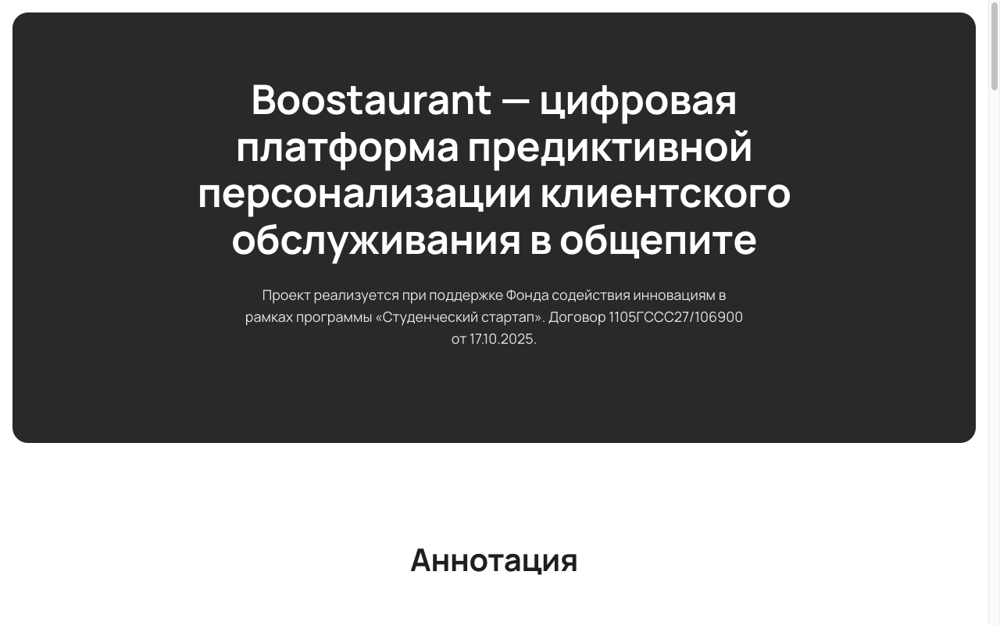

# 1.1 Создание сайта стартап-проекта

Сайт стартап-проекта Boostaurant опубликован по адресу https://www.boostaurant.ru/project/. Доменное имя boostaurant.ru зарегистрировано у регистратора REG.RU; обслуживание зоны выполняется DNS-серверами регистратора.

Сайт размещён в объектном хранилище Yandex Object Storage в режиме хостинга статического сайта. Соединение защищено протоколом HTTPS с сертификатом Let's Encrypt, выпуск и продление которого выполняются средствами Yandex Certificate Manager. Размещение в объектном хранилище выбрано вместо аренды виртуального сервера: сайт не содержит серверной логики, а стоимость хранения и раздачи статических файлов при характерной для проекта посещаемости несопоставимо ниже стоимости аренды сервера.

Сайт выполнен как статический: страницы свёрстаны на HTML и CSS без использования конструкторов сайтов и серверной логики, поля ввода и формы сбора данных отсутствуют. Вёрстка адаптирована под мобильные устройства. Исходный код сайта хранится в репозитории проекта вместе с кодом платформы; публикация изменений выполняется сценарием развёртывания.

Сайт состоит из двух страниц: страницы проекта, подготовленной в соответствии с требованиями Фонда содействия инновациям, и главной страницы, адресованной потенциальным заказчикам.

**Страница проекта** (https://www.boostaurant.ru/project/) содержит сведения о разработке, выполненной за счёт средств гранта. Первый экран страницы приведён на рисунке 1.

*Рисунок 1 — Страница проекта, первый экран*

*Таблица 1 — Структура страницы проекта*

| № | Раздел | Содержание |
|---|--------|-----------|
| 1 | Заголовок | Наименование проекта, отметка о поддержке Фондом содействия инновациям, номер договора |
| 2 | Аннотация | Назначение продукта, решаемая задача, область применения |
| 3 | Технические характеристики | Состав платформы, используемые технологии, требования к серверу, состав обрабатываемых персональных данных, показатели прототипа |
| 4 | Особенности разработки | Принятые технические решения рекомендательного ядра |
| 5 | Изображения продукта | Схемы платформы и экраны интерфейса официанта |
| 6 | Подвал | Отметка о поддержке Фонда, реквизиты ООО «Бусторан», контакты |

Показатели прототипа приведены на странице в том виде, в котором они получены при проверке моделей: доля корректных рекомендаций для гостя с историей заказов, для гостя с единственным визитом и для гостя с тремя визитами, с указанием целевого значения и условий измерения (раздел 1.5). Отдельно указано, что данные прототипа синтетические. Изображения экранов интерфейса официанта сняты с работающего прототипа.

**Главная страница** (https://www.boostaurant.ru/) адресована владельцам и управляющим ресторанами и содержит условия пилотного внедрения.

*Таблица 2 — Структура главной страницы*

| № | Блок | Содержание |
|---|------|-----------|
| 1 | Обложка | Наименование и краткое описание продукта, ссылка для обращения |
| 2 | Проблема | Разрыв между данными ресторана и информированностью официанта |
| 3 | Как это работает | Три шага работы официанта с ботом |
| 4 | Расчёт выгоды | Пример расчёта окупаемости для типового ресторана |
| 5 | Условия пилота | Условия участия в пилотном внедрении |
| 6 | Цена | Стоимость подписки |
| 7 | Частые вопросы | Ответы на типовые вопросы, включая защиту персональных данных |
| 8 | Кому подходит | Критерии применимости продукта |
| 9 | Финальный призыв | Повторное предложение обратиться |

Единственное целевое действие главной страницы — обращение к представителю проекта в мессенджере. Формы обратной связи и поля ввода контактных данных не размещались: на этапе набора пилотных ресторанов каждое обращение обрабатывается индивидуально.

Обе страницы содержат сведения о поддержке проекта Фондом содействия инновациям и реквизиты ООО «Бусторан».
