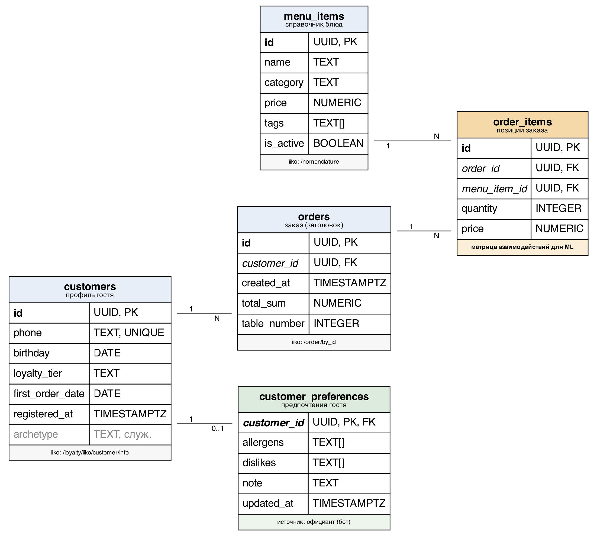

# 1.2 Создание базы данных

На данном этапе спроектирована и развёрнута база данных PostgreSQL из пяти таблиц, хранящая справочник меню, профили гостей, историю заказов и предпочтений. Структура данных рассчитана на построение обучающей выборки для рекомендательной модели непосредственно запросами к базе. Состав полей определён по результатам исследования API системы iiko — схема рассчитана на приём выгрузки из промышленной системы учёта без изменения структуры. База данных наполнена выборкой из 300 гостей и их истории заказов за 180 дней, сформированной по поведенческим архетипам, что обеспечило как обучение модели, так и проверяемую оценку её качества. Определён порядок поддержания данных в актуальном состоянии.

## Обоснование выбора системы управления базами данных

В качестве СУБД выбрана PostgreSQL. Решение обусловлено характером хранимых данных и режимом их использования.

Данные проекта имеют выраженную реляционную природу: гость — заказы — позиции заказа — блюдо меню связаны отношениями «один ко многим» с обязательным контролем ссылочной целостности. Позиция заказа не имеет смысла в отрыве от заказа, заказ — в отрыве от гостя. Реляционная модель с внешними ключами и каскадным удалением выражает эти ограничения на уровне схемы, а не прикладного кода, что исключает появление «висящих» записей при удалении гостя.

Обучение модели требует агрегации по всей истории: построение матрицы взаимодействий «гость × блюдо» выполняется одним запросом с группировкой по двум полям, расчёт признаков для кластеризации — соединением трёх таблиц с суммированием по категориям меню. Такие операции естественны для SQL и выполняются на стороне СУБД, без выгрузки истории заказов в память приложения.

Существенным для проекта является тип `TEXT[]` — массив строк, поддерживаемый PostgreSQL как штатный тип данных. В нём хранятся теги блюда (`menu_items.tags`) и аллергены гостя (`customer_preferences.allergens`). Жёсткая фильтрация выдачи по аллергенам сводится к пересечению двух массивов, что не требует ни отдельной таблицы связей, ни разбора строк на стороне приложения. В большинстве распространённых СУБД, включая MySQL, массив не является типом колонки, и тот же механизм потребовал бы справочника тегов и таблицы связи, то есть двух дополнительных таблиц и соединения при каждом обращении.

Дополнительными аргументами послужили: открытая лицензия, исключающая лицензионные отчисления и соответствующая ориентации проекта на низкую себестоимость обслуживания одного ресторана; наличие PostgreSQL в реестре отечественного программного обеспечения в составе российских сборок; функция `gen_random_uuid()`, позволяющая использовать UUID в качестве первичных ключей без внешних расширений. Выбор UUID, а не последовательных числовых идентификаторов, продиктован источником данных: iiko оперирует идентификаторами в формате UUID, и сохранение этого формата позволяет переносить идентификаторы гостей, заказов и блюд без преобразования и без хранения таблиц соответствия.

## Определение минимального набора данных

Состав таблиц и полей определялся по результатам исследования API iiko (см. раздел 1.4). Для каждого атрибута, доступного в API, оценивалась его применимость в рекомендательной модели, и в схему включались только те, что используются алгоритмами или необходимы для идентификации гостя.

Ключевой вывод, определивший структуру данных: основную ценность для персонализации представляет **история заказов**, а не анкетный профиль гостя. Пол, возраст и уровень лояльности слабо связаны с предпочтениями в меню — два гостя одного возраста и пола могут иметь противоположные вкусы, тогда как повторный заказ блюда является прямым и сильным свидетельством предпочтения. Поэтому центральной таблицей схемы является `order_items`, содержащая позиции заказов: именно из неё строится матрица взаимодействий для коллаборативной фильтрации. Профиль гостя используется ограниченно — для идентификации и отображения официанту.

Из состава полей, доступных в API iiko, в схему намеренно не включены: имя и фамилия гостя, пол, адрес электронной почты, баланс бонусных счетов, сведения о картах лояльности, изображения блюд, пищевая ценность. Часть из них не влияет на рекомендации, часть относится к персональным данным, обработка которых для решаемой задачи не требуется. Состав хранимых сведений о госте ограничен теми, что используются в работе: телефон необходим как ключ идентификации гостя в iiko, дата рождения — для поздравления гостя и предложений в день рождения, уровень лояльности и даты — для отображения официанту. Сокращение объёма обрабатываемых персональных данных до необходимого минимума соответствует требованиям 152-ФЗ.

## Схема базы данных

База данных состоит из пяти таблиц, представленных на рисунке 1. Для каждой таблицы указан метод API iiko, служащий источником данных в промышленной эксплуатации.

*Рисунок 1 — Схема базы данных*

**`menu_items`** — справочник блюд. Признак `is_active` соответствует полю `isDeleted` в iiko: снятое с меню блюдо остаётся в истории заказов, но исключается из рекомендаций. Массив `tags` содержит характеристики состава («dairy», «gluten», «seafood», «vegetarian») и используется механизмом фильтрации по аллергенам.

**`customers`** — профиль гостя. Телефон служит ключом идентификации при получении данных из iiko по номеру столика. Поле `archetype` (показано на рисунке серым) является служебным и заполняется только генератором данных; в данных, полученных из промышленной системы, оно остаётся незаполненным.

**`orders`** — заголовок заказа. Дата используется при расчёте популярности блюд за период, итоговая сумма — при вычислении среднего чека, номер столика — при определении гостя по столику.

**`order_items`** — позиции заказа, центральная таблица для машинного обучения. Хранение цены на момент заказа, а не обращение к текущей цене блюда, обеспечивает корректность исторических сумм при изменении цен в меню.

**`customer_preferences`** — предпочтения гостя. В отличие от остальных таблиц, источником является не iiko, а сам официант: сведения вносятся через интерфейс бота. Аллергены и антипредпочтения пересекаются по значениям с тегами блюд и участвуют в фильтрации выдачи; текстовая заметка на рекомендации не влияет и отображается официанту.

Связи между таблицами реализованы внешними ключами. Удаление гостя каскадно удаляет его заказы, позиции заказов и предпочтения. Для блюд меню установлено ограничение `ON DELETE RESTRICT`: удалить блюдо, встречающееся в истории заказов, невозможно — вместо удаления предусмотрен перевод в неактивное состояние.

Определены индексы под запросы, выполняемые при обучении модели и обслуживании обращений: по блюду и по заказу в таблице позиций (построение матрицы взаимодействий), по гостю и по дате в таблице заказов (история гостя и расчёт популярности за период), по номеру столика (определение гостя по столику в режиме реального времени).

## Наполнение базы данных для прототипа

Для наполнения базы данных разработан генератор, формирующий справочник меню из 56 блюд в 12 категориях, 300 гостей и историю их заказов за 180 дней.

Данные сформированы не случайным образом, а по пяти поведенческим архетипам: «Мясоед», «Вегетарианец», «Сладкоежка», «Бизнес-ланч», «Гурман». Каждый архетип задаёт распределение вероятностей по категориям меню, диапазон числа позиций в заказе, частоту посещений и долю визитов в будние дни. Внутри выбранной категории конкретное блюдо определяется его относительным весом — так у архетипа появляются не только предпочитаемые категории, но и любимые блюда.

Такой подход обусловлен требованиями алгоритма. Коллаборативная фильтрация восстанавливает предпочтения гостя, опираясь на сходство с другими гостями; при равномерном случайном выборе блюд матрица взаимодействий не содержит структуры, и обучение модели лишено смысла. Дополнительно в выборку вносится 12 % случайных позиций: без такого шума данные оказываются идеально разделимыми, и оценка качества модели становится завышенной.

Существенным следствием этого решения является возможность **проверяемой оценки качества**. Архетип каждого гостя сохраняется в базе данных и не участвует в обучении — ни модель коллаборативной фильтрации, ни алгоритм кластеризации его не получают. Он используется исключительно после обучения, как эталон: рекомендации считаются корректными, если предложенные блюда относятся к категориям, характерным для архетипа данного гостя. Именно это позволило измерить точность рекомендаций (раздел 1.5) и обосновать выбор параметров модели. На данных промышленной эксплуатации подобная разметка отсутствует, и качество оценивается по фактическому поведению гостей в ходе опытной эксплуатации.

Генератор также заполняет предпочтения примерно для четверти гостей: аллергены выбираются из перечня, пересекающегося с тегами блюд, что позволяет проверить работу фильтрации на данных, воспроизводящих реальный сценарий.

В промышленной эксплуатации содержимое базы данных поддерживается в актуальном состоянии синхронизатором, выполняющим ежесуточную инкрементальную выгрузку из iiko с последующим еженедельным переобучением моделей. Порядок обращений к методам iiko приведён в разделе 1.4.
