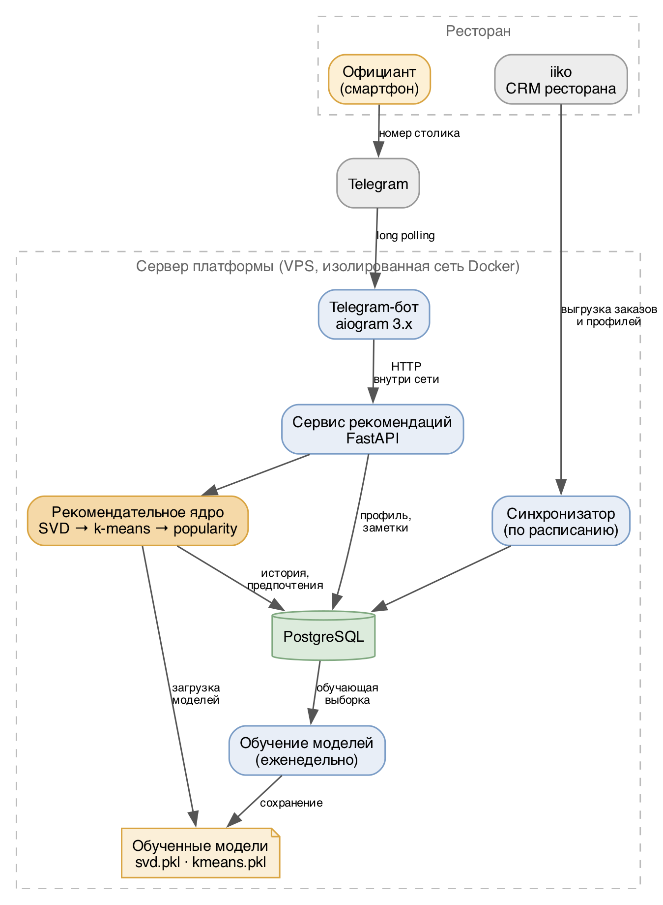

# 1.3 Разработка архитектуры цифровой платформы

На данном этапе разработана архитектура платформы: определён состав компонентов, порядок их взаимодействия, принципы размещения на сервере и защиты данных, а также выбраны алгоритмы формирования рекомендаций. Архитектура подчинена двум требованиям, следующим из условий применения: ответ официанту должен быть получен за несколько секунд в зале ресторана, а рекомендация должна выдаваться любому гостю — независимо от того, известен он системе или пришёл впервые.

## Состав компонентов

Платформа построена из компонентов, каждый из которых решает одну задачу и взаимодействует с остальными через явные интерфейсы. Состав и связи приведены на рисунке 2.

*Рисунок 2 — Архитектура платформы*

**Telegram-бот** — интерфейс официанта. Принимает номер столика и отображает профиль гостя и рекомендации. Реализован на библиотеке aiogram.

**Сервис рекомендаций** — программный интерфейс (API), реализованный на FastAPI. Принимает обращения от бота, определяет гостя по номеру столика, обращается к рекомендательному ядру и возвращает результат. Является единственной точкой входа: вся прикладная логика сосредоточена здесь, а бот отвечает только за отображение.

**Рекомендательное ядро** — три алгоритма формирования рекомендаций с механизмом переключения между ними и последующей фильтрацией по ограничениям гостя.

**Синхронизатор** — фоновый компонент, поддерживающий данные в актуальном состоянии: выгружает из iiko заказы, профили гостей и справочник меню.

**Обучение моделей** — периодический процесс, формирующий обучающую выборку из базы данных и сохраняющий обученные модели в виде файлов.

**База данных** PostgreSQL и **обученные модели** — хранилища. Модели сохраняются отдельно от базы: они загружаются в память один раз при запуске сервиса и не читаются при каждом обращении.

Разделение бота и сервиса рекомендаций — принципиальное решение. Telegram выбран как первый интерфейс, но не единственный: заявленное развитие продукта предполагает мобильное приложение и веб-интерфейс для управляющего. Поскольку бот не содержит прикладной логики, добавление нового интерфейса не затрагивает ни ядро, ни базу данных — новый клиент обращается к тому же API.

## Выбор алгоритмов формирования рекомендаций

Задача состоит в том, чтобы по гостю и меню ресторана определить блюда, которые он с наибольшей вероятностью закажет. Основным алгоритмом выбрана **коллаборативная фильтрация** методом матричного разложения (SVD).

Обоснование выбора. Исходными данными является история заказов — сведения о том, какие блюда и сколько раз брал каждый гость. Явных оценок блюд гости не выставляют, но повторный заказ представляет собой сильное свидетельство предпочтения. Коллаборативная фильтрация работает именно с такими данными: она выявляет скрытые закономерности в поведении множества гостей и переносит их на конкретного человека, позволяя рекомендовать блюда, которые гость ещё не пробовал, но которые нравятся людям с похожими вкусами. Альтернативный подход — рекомендации по содержательному сходству блюд — потребовал бы подробного описания состава каждой позиции меню и не выявлял бы неочевидных сочетаний.

Ограничение коллаборативной фильтрации состоит в том, что она бесполезна для гостя, отсутствующего в обучающей выборке: для незнакомого идентификатора модель возвращает одинаковую оценку для всех блюд, и упорядочивание такого списка даёт произвольный порядок. Между тем новые гости составляют существенную долю посетителей, и оставить их без рекомендаций недопустимо. Существенно, что гость попадает в обучающую выборку только при очередном переобучении: до этого момента, сколько бы заказов он ни сделал, персонализированных рекомендаций для него не существует. Периодичность переобучения является тем самым параметром, который определяет, насколько быстро новый гость переходит на персональное обслуживание.

Поэтому архитектурно предусмотрены **три слоя** с последовательным переходом по мере убывания сведений о госте:

| Слой | Когда применяется | Что использует |
|------|-------------------|----------------|
| Коллаборативная фильтрация | гость есть в обученной модели | его личная история заказов |
| Кластеризация (k-means) | гостя нет в модели, но есть хотя бы один заказ | предпочтения похожих гостей |
| Популярность | о госте не известно ничего | продажи ресторана за 30 дней |

Второй слой решает задачу «холодного старта». По одному заказу можно вычислить средний чек и распределение по категориям меню, определить сегмент гостя и предложить то, что заказывают похожие на него посетители. Метод k-means выбран как алгоритм, не требующий заранее размеченных сегментов: он выделяет группы гостей по фактическому поведению, а не по заданным вручную категориям, — что важно, поскольку в каждом ресторане структура посетителей своя.

Третий слой обеспечивает работоспособность системы в любом случае: если о госте нет никаких сведений, официант получает популярные блюда. Этот слой не требует моделей и работает на прямом запросе к базе данных, что делает систему устойчивой к отсутствию обученных моделей.

Ответ содержит указание на сработавший слой, и бот отображает его официанту. Это осознанное решение: официанту важно отличать персональную рекомендацию от общего списка популярных блюд, поскольку от этого зависит, как он преподнесёт предложение гостю. Система не выдаёт неизвестное за персонализацию.

Дополнительно предусмотрен **фильтр по ограничениям гостя**: блюда, содержащие отмеченные официантом аллергены или нежелательные ингредиенты, исключаются из выдачи независимо от оценки модели. Фильтрация выполняется именно как исключение, а не как понижение приоритета: аллергия относится к вопросам безопасности, и такое блюдо не должно попасть в рекомендацию ни при каких условиях.

## Размещение и защита данных

Платформа размещается на выделенном виртуальном сервере. Все компоненты запускаются в контейнерах Docker, что обеспечивает воспроизводимость развёртывания и независимость от настроек конкретного сервера. Для каждого ресторана разворачивается отдельный экземпляр с собственной базой данных и собственными моделями: меню и структура посетителей у ресторанов различаются, и общая модель для нескольких заведений давала бы худший результат.

Принятая схема размещения не требует открытия во внешнюю сеть ни одного порта:

- бот работает в режиме периодического опроса серверов Telegram (long polling) — он сам инициирует исходящие соединения и не принимает входящих;
- сервис рекомендаций доступен только изнутри сети контейнеров и вызывается исключительно ботом;
- база данных доступна только сервису рекомендаций.

Такое решение существенно для защиты персональных данных гостей: сервис не имеет ни аутентификации, ни ограничения частоты обращений, и его доступность извне означала бы возможность обращения к данным гостей произвольным лицом. Административные операции выполняются через защищённое соединение с сервером.

Данные ресторана не покидают его экземпляра: обученные модели не переносятся между ресторанами, а данные гостей не передаются во внешние системы. Размещение серверов на территории Российской Федерации соответствует требованиям законодательства о персональных данных.
