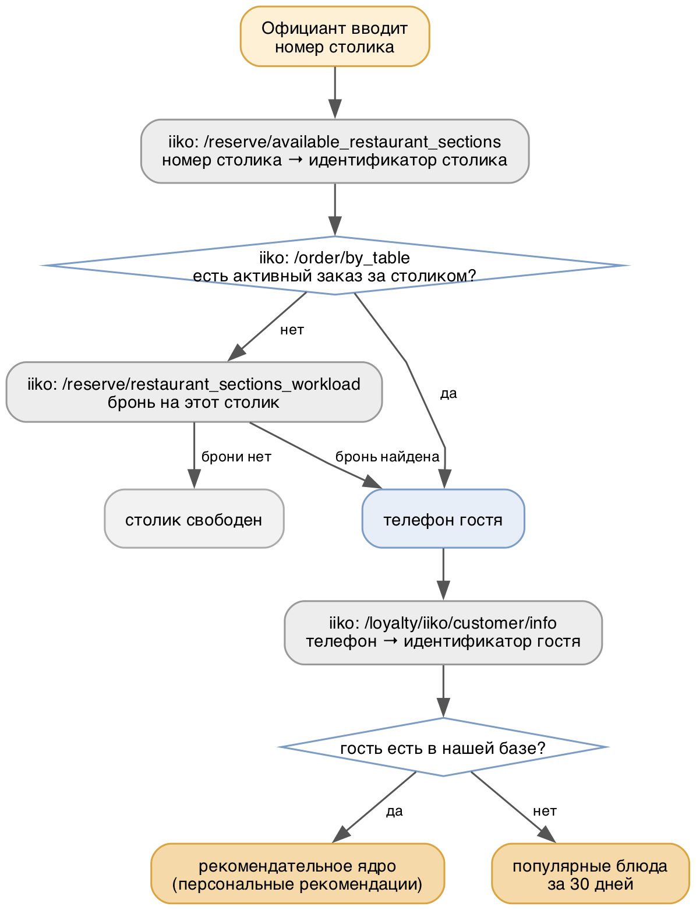

# 1.4 Разработка интеграции для получения данных от CRM iiko

На данном этапе исследован программный интерфейс системы iiko, определён состав доступных данных и разработан порядок обмена: идентификация гостя по номеру столика в режиме реального времени и фоновая выгрузка истории заказов для обучения модели. Установлено, что все сведения, необходимые платформе, доступны штатными методами API.

## Исследование программного интерфейса iiko

Исследование проводилось по официальной спецификации iiko Cloud API в формате OpenAPI, содержащей около 200 методов. По результатам изучения отобраны методы, покрывающие потребности платформы (таблица 4).

*Таблица 4 — Описание методов API iiko*

| Метод | Получаемые данные | Назначение |
|-------|-------------------|------------|
| `/api/1/nomenclature` | справочник блюд: наименование, группа меню, категория, цена, теги, признак удаления | наполнение справочника меню |
| `/api/1/loyalty/iiko/customer/info` | профиль гостя: идентификатор, телефон, дата рождения, категории лояльности, дата первого заказа | идентификация и профиль гостя |
| `/api/1/loyalty/iiko/customer/transactions/by_date` | транзакции гостя за период, включая идентификаторы заказов | первый шаг получения истории |
| `/api/1/order/by_id` | полный состав заказа с позициями, количеством и ценами | второй шаг получения истории |
| `/api/1/reserve/available_restaurant_sections` | секции зала и столики: идентификатор, номер, наименование | сопоставление номера столика с внутренним идентификатором |
| `/api/1/order/by_table` | активный заказ за столиком: гость, телефон, состав, статус | определение гостя за столиком |
| `/api/1/reserve/restaurant_sections_workload` | брони на период: телефон, гость, столики, статус | определение гостя при отсутствии открытого заказа |

Существенным результатом исследования является установленная возможность получить идентификатор гостя, не обращаясь к нему за телефоном или картой лояльности: связь «столик — гость» восстанавливается через активный заказ или бронь. Именно это делает возможным заявленный сценарий работы официанта.

Обмен выполняется по протоколу HTTPS с авторизацией по ключу API, выдаваемому рестораном. Ключ предоставляет доступ только на чтение данных: платформа не изменяет сведения в системе учёта ресторана и не вмешивается в работу кассовых терминалов.

## Идентификация гостя по номеру столика

Порядок действий при обращении официанта приведён на рисунке 4.

*Рисунок 4 — Определение гостя по номеру столика*

Официант вводит номер столика — единственное, что он знает о госте в момент обслуживания. Номер столика в зале и его внутренний идентификатор в системе учёта различаются, поэтому первым шагом выполняется сопоставление через справочник секций зала.

Основным источником сведений о госте служит активный заказ за столиком. Обращение к списку броней предусмотрено для наиболее ценного случая — гость только сел за стол и ещё ничего не заказал, то есть рекомендация нужна официанту именно сейчас; телефон, оставленный при бронировании, позволяет определить гостя и в этот момент.

Число обращений к внешней системе составляет от двух до трёх, что укладывается в требование по времени ответа. История заказов в этом режиме не запрашивается — она уже находится в локальной базе после фоновой синхронизации.

## Получение истории заказов

Обучающая выборка формируется фоновой синхронизацией, выполняемой по расписанию. Порядок обращений следующий.

1. Запрашиваются заказы, изменившиеся с момента предыдущей синхронизации. Выгрузка инкрементальная — по номеру последней обработанной ревизии.
2. Из полученных заказов извлекаются идентификаторы гостей.
3. По каждому идентификатору запрашивается профиль гостя.
4. По каждому гостю запрашиваются транзакции за период — они содержат идентификаторы его заказов.
5. По полученным идентификаторам запрашивается полный состав заказов с позициями.
6. Данные сохраняются в локальную базу, после чего выполняется переобучение моделей.

Двухшаговое получение истории (пункты 4 и 5) обусловлено устройством API: сведения о транзакциях гостя и состав заказа предоставляются разными методами. При проектировании синхронизатора это требует объединения идентификаторов заказов в пакеты, иначе число обращений к API окажется избыточным.

Список гостей формируется как побочный результат синхронизации заказов. Метода, возвращающего всех гостей ресторана, в API не предусмотрено: сведения о госте доступны только по известному идентификатору — телефону, карте, адресу электронной почты или внутреннему идентификатору. Поэтому база гостей наполняется постепенно, от прогона к прогону, по мере появления заказов.

В соответствии с планом работ синхронизатор описан на уровне порядка обмена и в прототипе не реализован: для проверки рекомендательной модели он не требуется, поскольку обучающая выборка формируется генератором (раздел 1.2).

## Реализация в прототипе

Для проверки сквозного сценария разработан модуль, замещающий обращения к iiko при определении гостя по номеру столика. Он воспроизводит логику активного заказа: возвращает гостя, чей заказ за указанным столиком является наиболее поздним.

Существенным свойством модуля является то, что во внешний интерфейс он отдаёт ровно тот же результат, что и боевая интеграция, — идентификатор гостя. Благодаря этому переход на реальное подключение к iiko затрагивает только данный модуль: сервис рекомендаций и рекомендательное ядро остаются без изменений. Это подтверждено практически — сквозной сценарий «номер столика → профиль гостя → рекомендации» работает в полном объёме (раздел 1.5).

## Системы бронирования

В ходе работ рассматривалась целесообразность отдельной интеграции с системой бронирования Bnovo. По результатам изучения от неё решено отказаться: Bnovo представляет собой систему управления бронированием для гостиничного бизнеса и в предприятиях общественного питания практически не применяется — исключением являются немногочисленные рестораны при отелях, где она используется как часть гостиничной инфраструктуры.

Функция бронирования столиков, необходимая платформе, доступна непосредственно в iiko — методы работы с секциями зала и бронями входят в исследованный интерфейс и уже задействованы при идентификации гостя. При появлении ресторанов-партнёров, использующих иные системы бронирования, соответствующая интеграция может быть разработана по той же схеме: заменяется только модуль определения гостя по столику.
